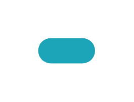

# Pill badge, info

## Definition

```js
{
  _style: {
    entity: 'rounded=1;whiteSpace=wrap;html=1;arcSize=50;strokeColor=none;strokeWidth=1;fillColor=#1CA5B8;fontColor=#ffffff;whiteSpace=wrap;align=left;verticalAlign=middle;spacingLeft=0;fontStyle=1;fontSize=14;spacing=10;',
  },
  _width: 45,
  _height: 20,
}
```

## Usage

```js
import { PillBadgeInfo } from '@dinghy/standard-components-diagrams/bootstrap'

<PillBadgeInfo/>
```

## Preview


