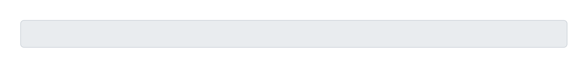

# Readonly input

## Definition

```js
{
  _style: {
    entity: 'html=1;shadow=0;dashed=0;shape=mxgraph.bootstrap.rrect;rSize=5;strokeColor=#CED4DA;strokeWidth=1;fillColor=#E9ECEF;fontColor=#505050;whiteSpace=wrap;align=left;verticalAlign=middle;spacingLeft=10;fontSize=14;',
  },
  _width: 800,
  _height: 40,
}
```

## Usage

```js
import { ReadonlyInput } from '@dinghy/standard-components-diagrams/bootstrap'

<ReadonlyInput/>
```

## Preview


