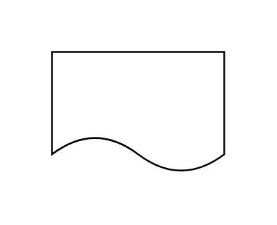
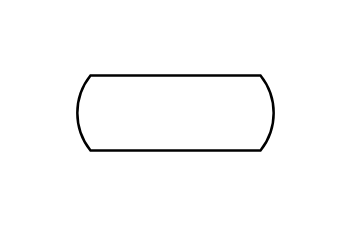
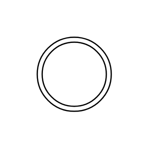
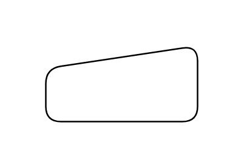

# Software Data Flow Diagram Entities

- [ActivityProcessEntityExternalInteractor](./activity-process-entity-external-interactor.md)  

- [Check](./check.md)  

- [Check2](./check-2.md)  

- [DataProcess](./data-process.md)  

- [DataStore](./data-store.md)  

- [DataStore2](./data-store-2.md)  

- [DataStore3](./data-store-3.md)  

- [DataStoreWithId](./data-store-with-id.md)  

- [DecisionEntityRelationship](./decision-entity-relationship.md)  

- [Entity](./entity.md)  

- [ExternalEntity](./external-entity.md)  

- [FinalReportArchive](./final-report-archive.md)  

- [InformationDataCarrierSop](./information-data-carrier-sop.md)  

- [InformationDataCarrierSopStopState](./information-data-carrier-sop-stop-state.md)  

- [Loop](./loop.md)  

- [MultipleProcessStartStateMultiState](./multiple-process-start-state-multi-state.md)  

- [Object](./object.md)  

- [OrderCommand](./order-command.md)  

- [ProductResult](./product-result.md)  

- [Reference](./reference.md)  

- [StartEnd](./start-end.md)  

- [StopState](./stop-state.md)  

