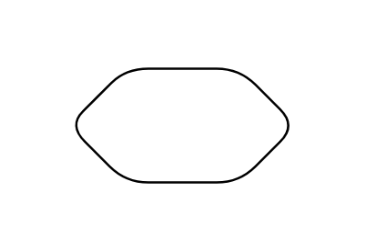

# Check

## Definition

```js
{
  _style: {
    entity: 'shape=hexagon;perimeter=hexagonPerimeter2;whiteSpace=wrap;html=1;size=0.25',
  },
  _width: 100,
  _height: 50,
}
```

## Usage

```js
import { Check } from '@dinghy/standard-components-diagrams/dataFlowDiagram'

<Check/>
```

## Preview


