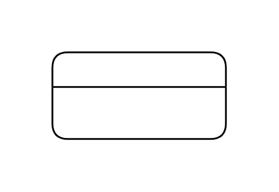

# Entity

## Definition

```js
{
  _style: {
    entity: 'swimlane;fontStyle=0;childLayout=stackLayout;horizontal=1;startSize=20;fillColor=#ffffff;horizontalStack=0;resizeParent=1;resizeParentMax=0;resizeLast=0;collapsible=0;marginBottom=0;swimlaneFillColor=#ffffff;',
  },
  _width: 100,
  _height: 50,
}
```

## Usage

```js
import { Entity } from '@dinghy/standard-components-diagrams/dataFlowDiagram'

<Entity/>
```

## Preview


