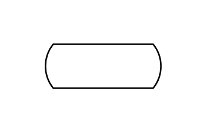

# Loop

## Definition

```js
{
  _style: {
    entity: 'html=1;dashed=0;whiteSpace=wrap;shape=mxgraph.dfd.loop',
  },
  _width: 80,
  _height: 30,
}
```

## Usage

```js
import { Loop } from '@dinghy/standard-components-diagrams/dataFlowDiagram'

<Loop/>
```

## Preview


