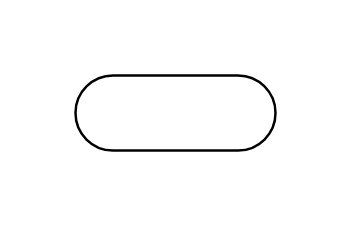

# Start / End

## Definition

```js
{
  _style: {
    entity: 'html=1;dashed=0;whiteSpace=wrap;shape=mxgraph.dfd.start',
  },
  _width: 80,
  _height: 30,
}
```

## Usage

```js
import { StartEnd } from '@dinghy/standard-components-diagrams/dataFlowDiagram'

<StartEnd/>
```

## Preview


