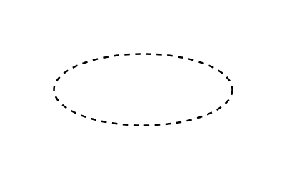

# Derived Attribute

## Definition

```js
{
  _style: {
    entity: 'ellipse;whiteSpace=wrap;html=1;align=center;dashed=1;',
  },
  _width: 100,
  _height: 40,
}
```

## Usage

```js
import { DerivedAttribute } from '@dinghy/standard-components-diagrams/entityRelation'

<DerivedAttribute/>
```

## Preview


