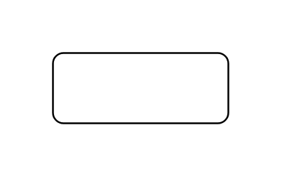

# Entity 2

## Definition

```js
{
  _style: {
    entity: 'whiteSpace=wrap;html=1;align=center;',
  },
  _width: 100,
  _height: 40,
}
```

## Usage

```js
import { Entity2 } from '@dinghy/standard-components-diagrams/entityRelation'

<Entity2/>
```

## Preview


