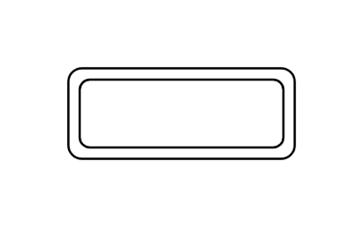

# Weak Entity

## Definition

```js
{
  _style: {
    entity: 'shape=ext;margin=3;double=1;whiteSpace=wrap;html=1;align=center;',
  },
  _width: 100,
  _height: 40,
}
```

## Usage

```js
import { WeakEntity } from '@dinghy/standard-components-diagrams/entityRelation'

<WeakEntity/>
```

## Preview


