# iOS iOS6 Entities

- [Add](./add.md)  

- [AlertBox](./alert-box.md)  
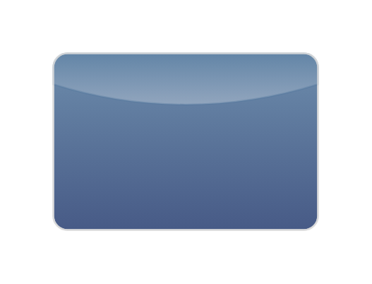

- [AlphabetList](./alphabet-list.md)  

- [AppBarPortrait](./app-bar-portrait.md)  

- [Arrow](./arrow.md)  

- [BackButton](./back-button.md)  
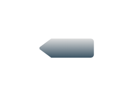

- [Button](./button.md)  
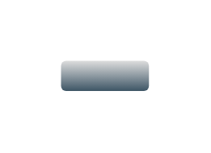

- [ButtonBar](./button-bar.md)  

- [ButtonBar2](./button-bar-2.md)  

- [ButtonGroupHorizontal](./button-group-horizontal.md)  

- [CallButtons](./call-buttons.md)  
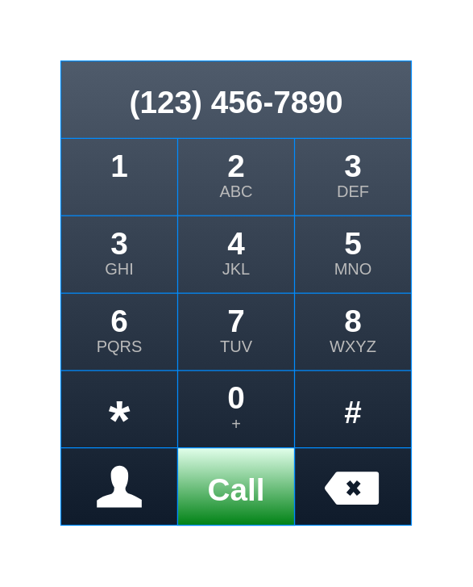

- [CallDialog](./call-dialog.md)  
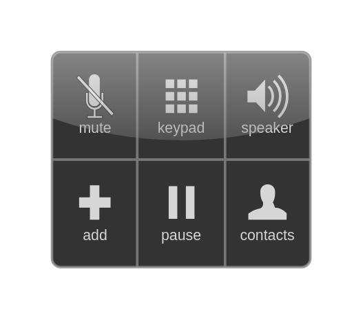

- [Check](./check.md)  
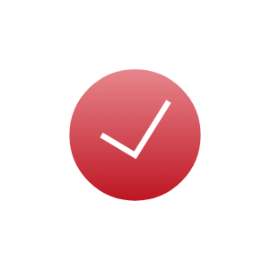

- [CloudProgressBar](./cloud-progress-bar.md)  
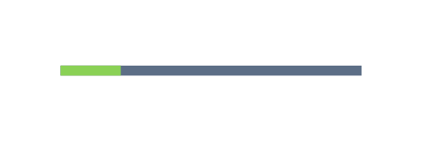

- [Combobox](./combobox.md)  
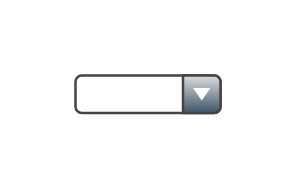

- [Copy](./copy.md)  
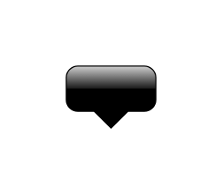

- [CopyArea](./copy-area.md)  

- [CopyArea2](./copy-area-2.md)  
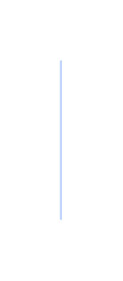

- [Delete](./delete.md)  
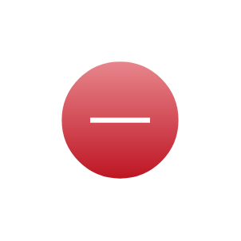

- [DeleteApp](./delete-app.md)  
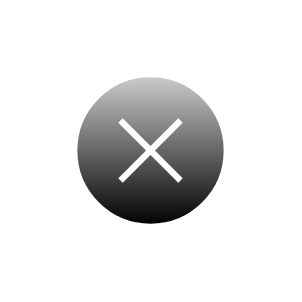

- [Direction](./direction.md)  
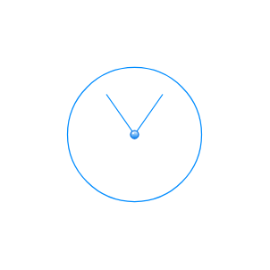

- [DownloadBar](./download-bar.md)  
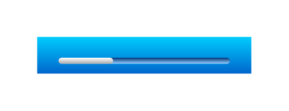

- [ForwardButton](./forward-button.md)  

- [HomePageControl](./home-page-control.md)  

- [IconGrid](./icon-grid.md)  
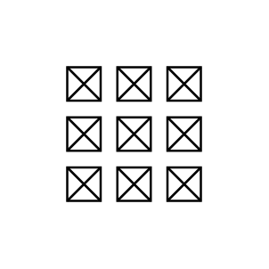

- [Info](./info.md)  

- [IpadLandscape](./ipad-landscape.md)  
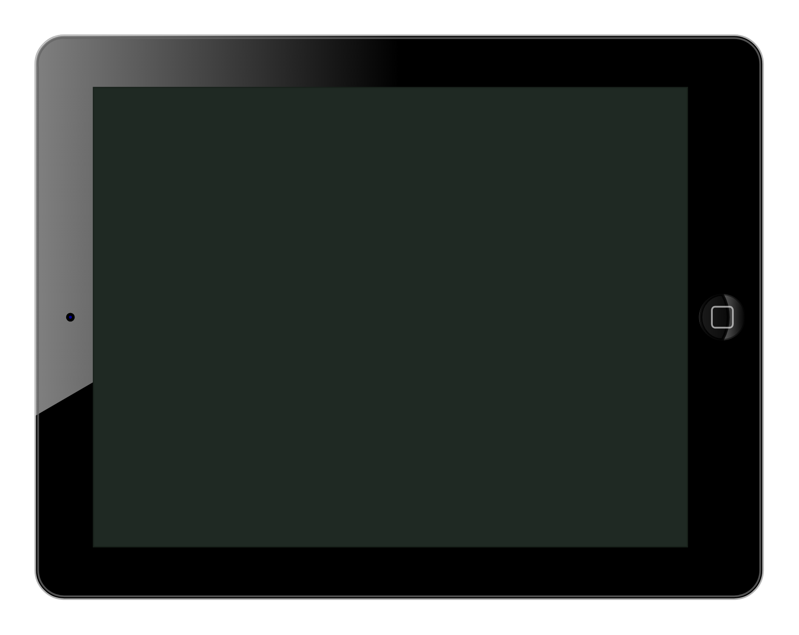

- [IpadPortrait](./ipad-portrait.md)  
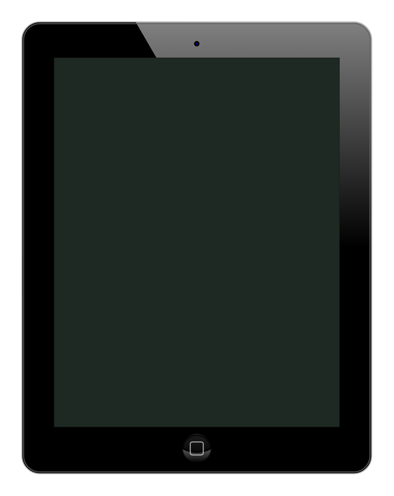

- [IpadBackgroundGray](./ipad-background-gray.md)  
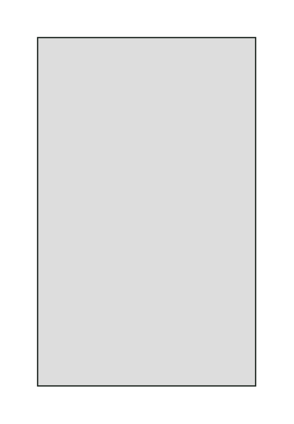

- [IpadBackgroundGreen](./ipad-background-green.md)  

- [IpadBackgroundMap](./ipad-background-map.md)  
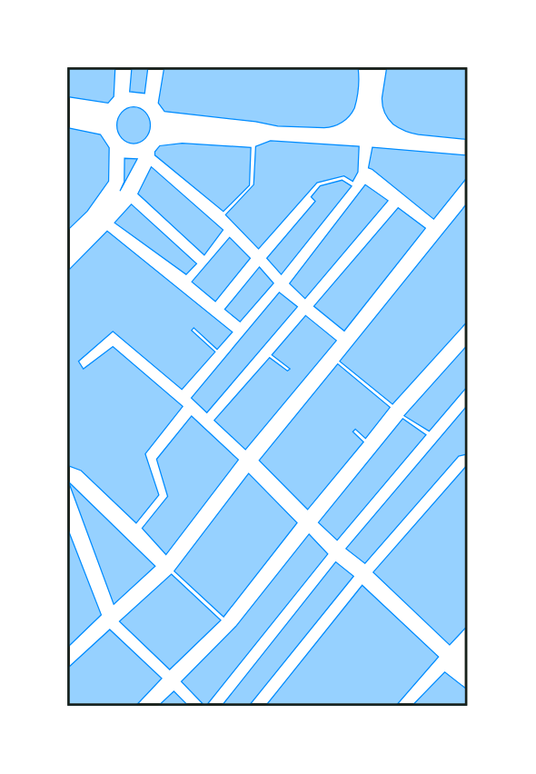

- [IpadBackgroundStriped](./ipad-background-striped.md)  
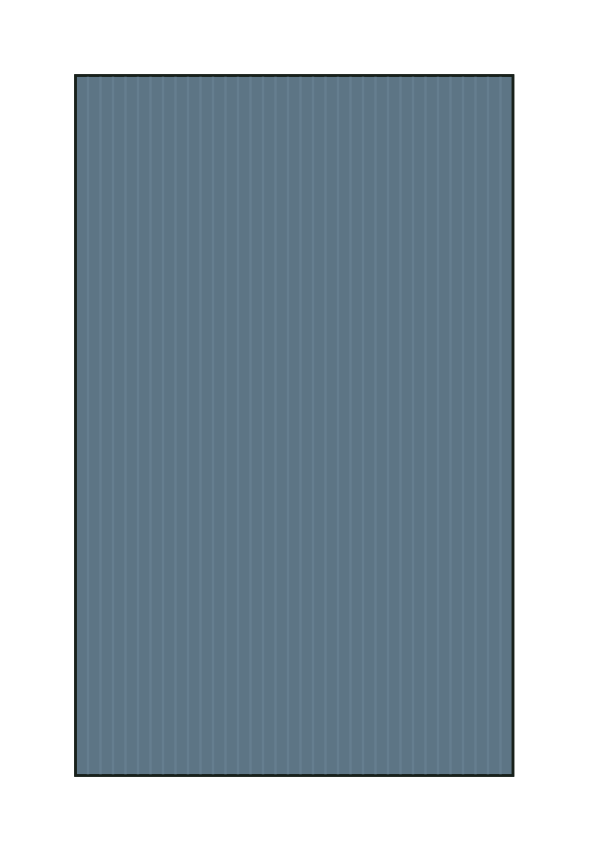

- [IpadBackgroundWhite](./ipad-background-white.md)  
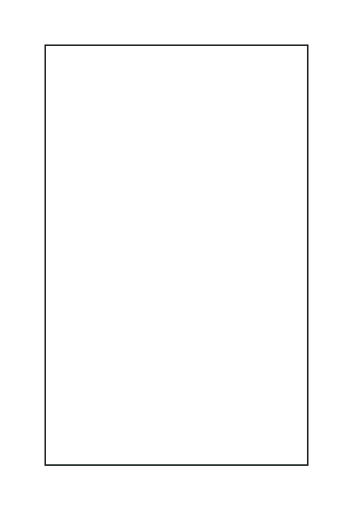

- [IphoneLandscape](./iphone-landscape.md)  
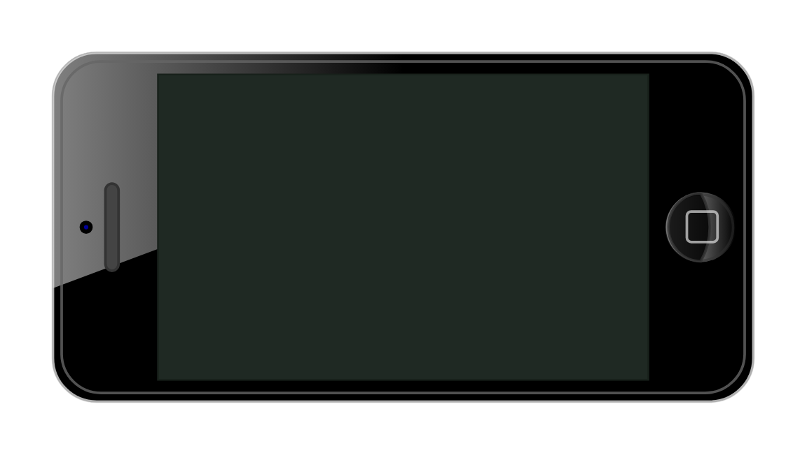

- [IphonePortrait](./iphone-portrait.md)  
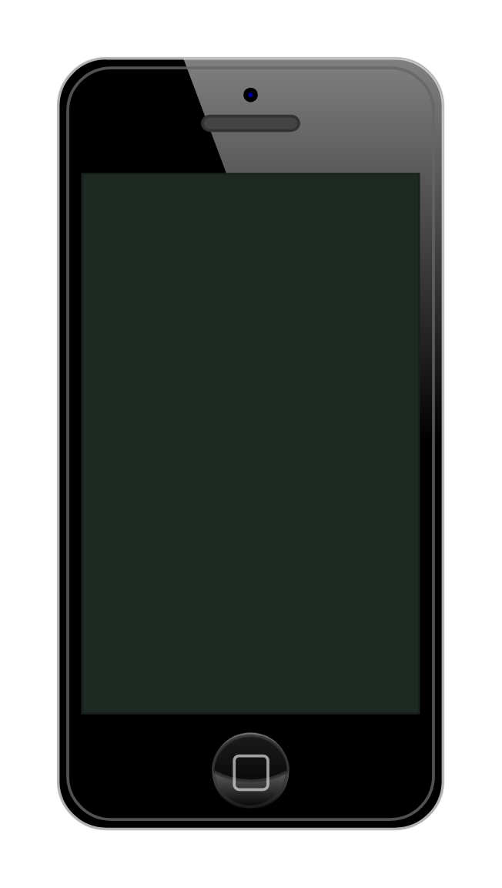

- [KeyboardLetters](./keyboard-letters.md)  
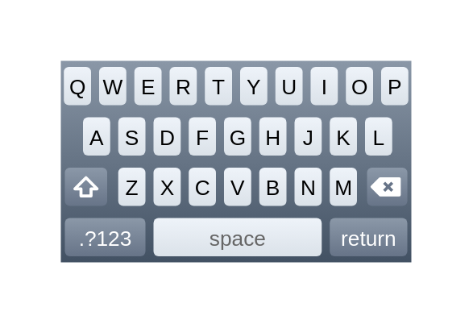

- [KeyboardNumbers](./keyboard-numbers.md)  

- [KeyboardSymbols](./keyboard-symbols.md)  
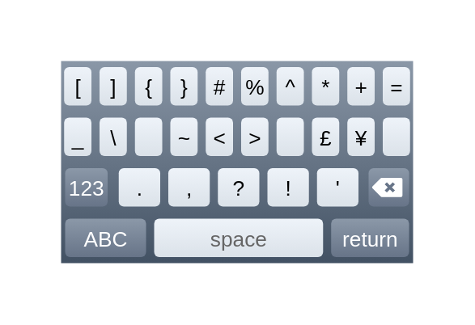

- [LocationBar](./location-bar.md)  
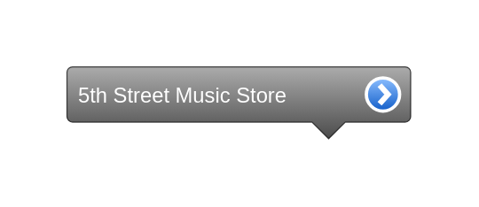

- [LockButton](./lock-button.md)  

- [OnOffButton](./on-off-button.md)  

- [Option](./option.md)  
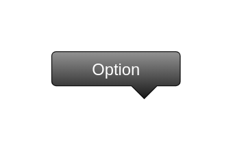

- [PageControl](./page-control.md)  
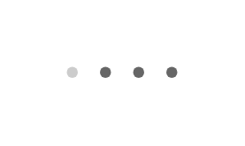

- [PasswordField](./password-field.md)  

- [Pin](./pin.md)  
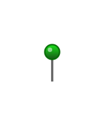

- [Pin2](./pin-2.md)  
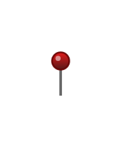

- [Pin3](./pin-3.md)  
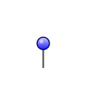

- [Pin4](./pin-4.md)  
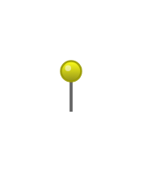

- [Pin5](./pin-5.md)  
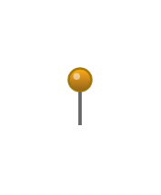

- [PrevNextButton](./prev-next-button.md)  
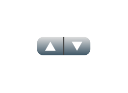

- [ProgressBar](./progress-bar.md)  
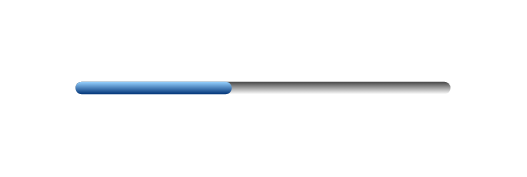

- [RadioButtons](./radio-buttons.md)  

- [ScreenNameBar](./screen-name-bar.md)  

- [Slider](./slider.md)  
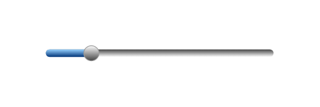

- [SortFind](./sort-find.md)  
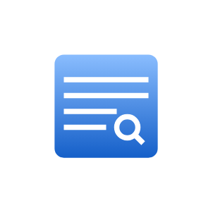

- [TextInput](./text-input.md)  
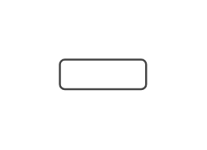

- [TopBar](./top-bar.md)  

- [TopBarLocked](./top-bar-locked.md)  

- [UrlBar](./url-bar.md)  

- [VideoControls](./video-controls.md)  
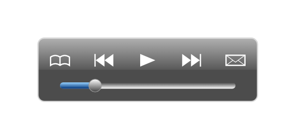
