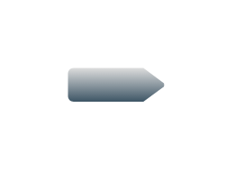

# Forward button

## Definition

```js
{
  _style: {
    entity: 'strokeWidth=1;html=1;shadow=0;dashed=0;shape=mxgraph.ios.iButtonFw;strokeColor=#444444;fontColor=#ffffff;buttonText=;fontSize=8;fillColor=#dddddd;fillColor2=#3D5565;spacingRight=10;whiteSpace=wrap;align=center;sketch=0;',
  },
  _width: 43.5,
  _height: 15,
}
```

## Usage

```js
import { ForwardButton } from '@dinghy/standard-components-diagrams/ios6'

<ForwardButton/>
```

## Preview


