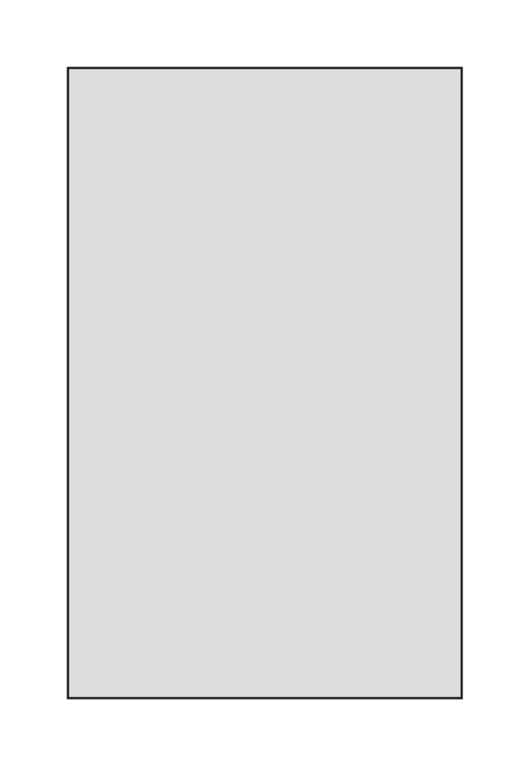

# iPad background (gray)

## Definition

```js
{
  _style: {
    entity: 'verticalLabelPosition=bottom;verticalAlign=top;html=1;shadow=0;dashed=0;strokeWidth=1;shape=mxgraph.ios.iBgFlat;strokeColor=#18211b;fillColor=#dddddd;',
  },
  _width: 175,
  _height: 280,
}
```

## Usage

```js
import { IpadBackgroundGray } from '@dinghy/standard-components-diagrams/ios6'

<IpadBackgroundGray/>
```

## Preview


