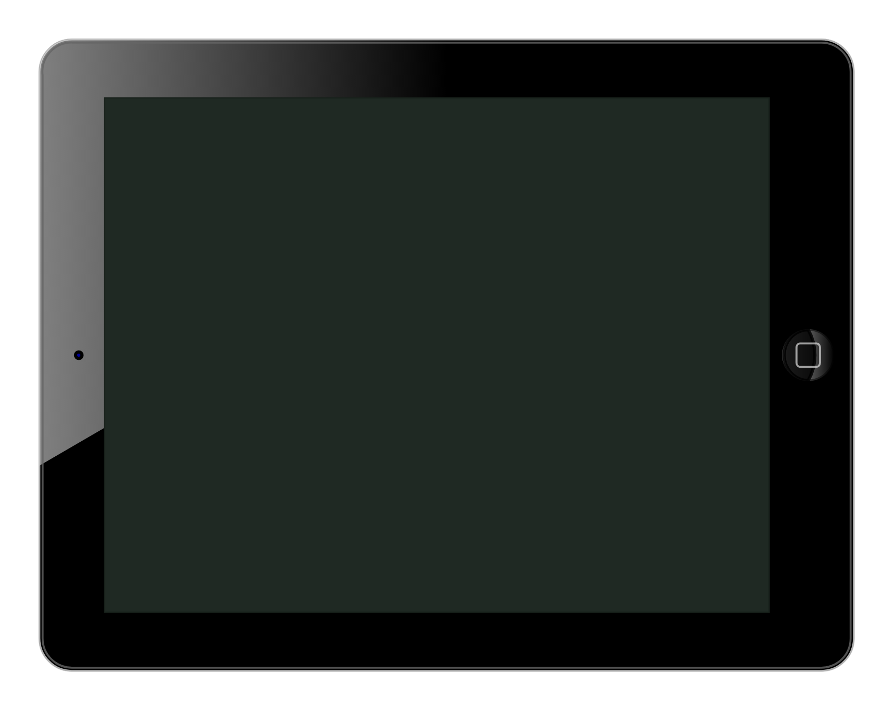

# iPad (landscape)

## Definition

```js
{
  _style: {
    entity: 'verticalLabelPosition=bottom;verticalAlign=top;html=1;shadow=0;dashed=0;strokeWidth=1;shape=mxgraph.ios.iPad;direction=north;bgStyle=bgGreen;fillColor=#aaaaaa;sketch=0;',
  },
  _width: 625,
  _height: 484.99999999999994,
}
```

## Usage

```js
import { IpadLandscape } from '@dinghy/standard-components-diagrams/ios6'

<IpadLandscape/>
```

## Preview


