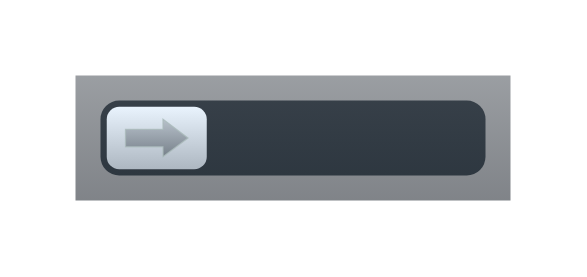

# Lock button

## Definition

```js
{
  _style: {
    entity: 'strokeWidth=1;html=1;shadow=0;dashed=0;shape=mxgraph.ios.iLockButton;fontColor=#cccccc;fontSize=13;mainText=;spacingLeft=50;spacingRight=10;align=center;sketch=0;whiteSpace=wrap;',
  },
  _width: 174,
  _height: 50,
}
```

## Usage

```js
import { LockButton } from '@dinghy/standard-components-diagrams/ios6'

<LockButton/>
```

## Preview


