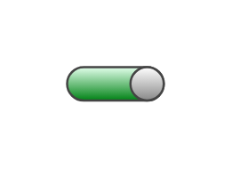

# On-off button

## Definition

```js
{
  _style: {
    entity: 'strokeWidth=1;html=1;shadow=0;dashed=0;shape=mxgraph.ios.iOnOffButton;mainText=;strokeColor=#444444;fontSize=9;fontColor=#ffffff;spacingRight=14;buttonState=on;sketch=0;',
  },
  _width: 43.5,
  _height: 15,
}
```

## Usage

```js
import { OnOffButton } from '@dinghy/standard-components-diagrams/ios6'

<OnOffButton/>
```

## Preview


