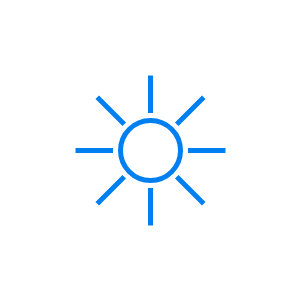

# Sun

## Definition

```js
{
  _style: {
    entity: 'html=1;verticalLabelPosition=bottom;align=center;labelBackgroundColor=#ffffff;verticalAlign=top;strokeWidth=2;strokeColor=#0080F0;shadow=0;dashed=0;shape=mxgraph.ios7.icons.sun;pointerEvents=1',
  },
  _original_width: 30,
  _original_height: 30,

}
```

## Usage

```js
import { Sun } from '@dinghy/standard-components-diagrams/ios7Icons'

<Sun/>
```

## Preview


