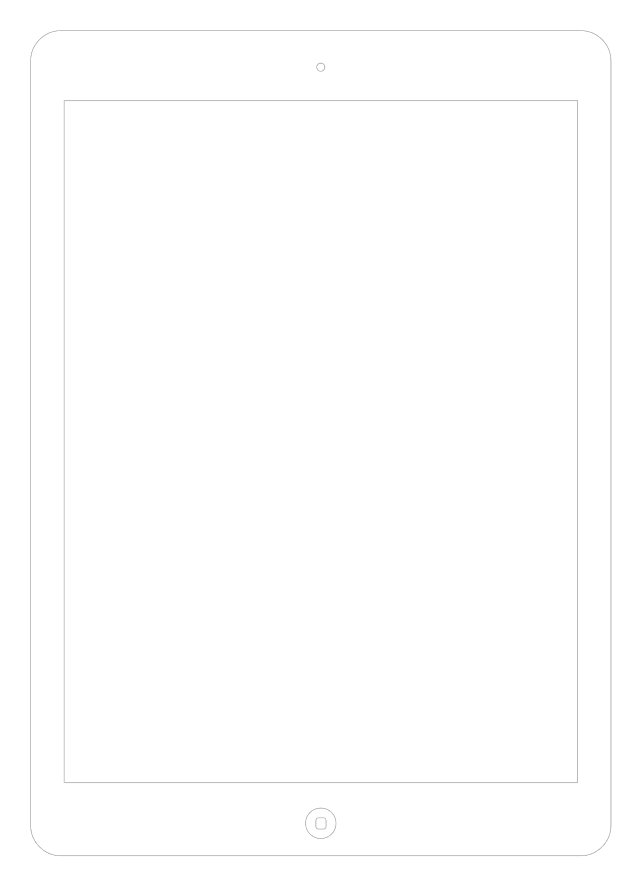

# iPad (13&#39;&#39;)

## Definition

```js
{
  _style: {
    entity: 'html=1;verticalLabelPosition=bottom;labelBackgroundColor=#ffffff;verticalAlign=top;shadow=0;dashed=0;strokeWidth=1;shape=mxgraph.ios7.misc.ipad13inch;strokeColor=#c0c0c0;',
  },
  _width: 572,
  _height: 813.0000000000001,
}
```

## Usage

```js
import { Ipad13 } from '@dinghy/standard-components-diagrams/ios7Ui'

<Ipad13/>
```

## Preview


