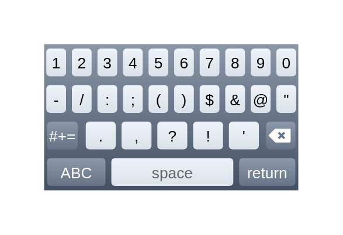

# iPhone Keyboard (numbers)

## Definition

```js
{
  _style: {
    entity: 'verticalLabelPosition=bottom;verticalAlign=top;html=1;shadow=0;dashed=0;strokeWidth=1;shape=mxgraph.ios.iKeybNumb;sketch=0;',
  },
  _width: 174,
  _height: 100,
}
```

## Usage

```js
import { IphoneKeyboardNumbers } from '@dinghy/standard-components-diagrams/ios7Ui'

<IphoneKeyboardNumbers/>
```

## Preview


