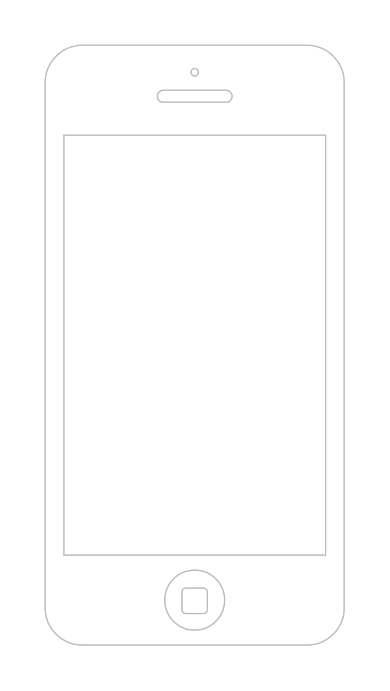

# iPhone (Portrait)

## Definition

```js
{
  _style: {
    entity: 'html=1;verticalLabelPosition=bottom;labelBackgroundColor=#ffffff;verticalAlign=top;shadow=0;dashed=0;strokeWidth=1;shape=mxgraph.ios7.misc.iphone;strokeColor=#c0c0c0;',
  },
  _width: 200,
  _height: 400,
}
```

## Usage

```js
import { IphonePortrait } from '@dinghy/standard-components-diagrams/ios7Ui'

<IphonePortrait/>
```

## Preview


