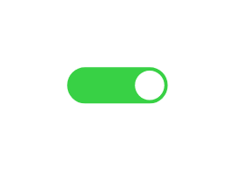

# On-off button (On)

## Definition

```js
{
  _style: {
    entity: 'html=1;verticalLabelPosition=bottom;labelBackgroundColor=#ffffff;verticalAlign=top;shadow=0;dashed=0;strokeWidth=1;shape=mxgraph.ios7ui.onOffButton;buttonState=on;strokeColor=#38D145;strokeColor2=#aaaaaa;fillColor=#38D145;fillColor2=#ffffff;',
  },
  _width: 43.5,
  _height: 15,
}
```

## Usage

```js
import { OnOffButtonOn } from '@dinghy/standard-components-diagrams/ios7Ui'

<OnOffButtonOn/>
```

## Preview


