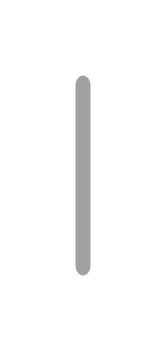

# Scroll (Vertical)

## Definition

```js
{
  _style: {
    entity: 'html=1;verticalLabelPosition=bottom;labelBackgroundColor=#ffffff;verticalAlign=top;shadow=0;dashed=0;strokeWidth=2;shape=mxgraph.ios7.misc.scroll_(vertical);fillColor=#a0a0a0;',
  },
  _width: 6,
  _height: 80,
}
```

## Usage

```js
import { ScrollVertical } from '@dinghy/standard-components-diagrams/ios7Ui'

<ScrollVertical/>
```

## Preview


