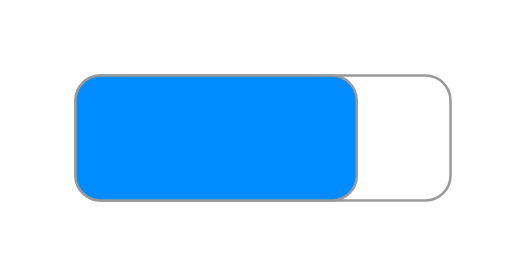

# Mockup Buttons Entities

- [Button](./button.md)  

- [FormattedButton](./formatted-button.md)  

- [HorizontalButtonBar](./horizontal-button-bar.md)  

- [OnOffButton](./on-off-button.md)  

- [VerticalButtonBar](./vertical-button-bar.md)  

