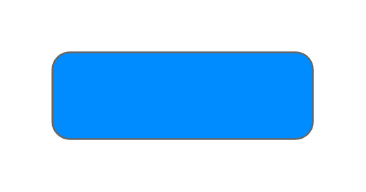

# Button

## Definition

```js
{
  _style: {
    entity: 'strokeWidth=1;shadow=0;dashed=0;align=center;html=1;shape=mxgraph.mockup.buttons.button;strokeColor=#666666;fontColor=#ffffff;mainText=;buttonStyle=round;fontSize=17;fontStyle=1;fillColor=#008cff;whiteSpace=wrap;',
  },
  _width: 150,
  _height: 50,
}
```

## Usage

```js
import { Button } from '@dinghy/standard-components-diagrams/mockupButtons'

<Button/>
```

## Preview


