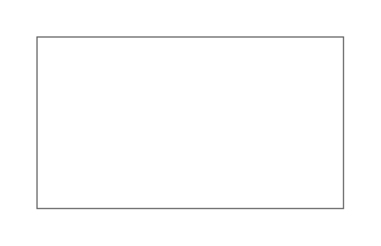
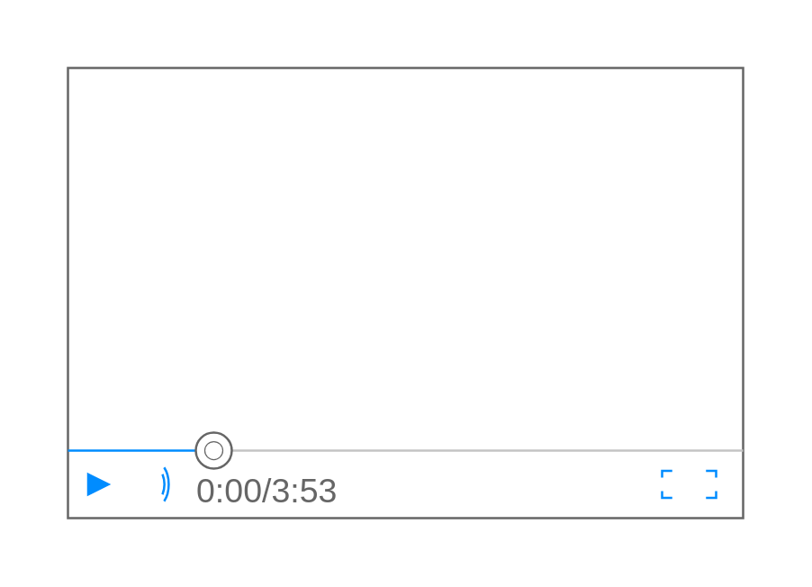
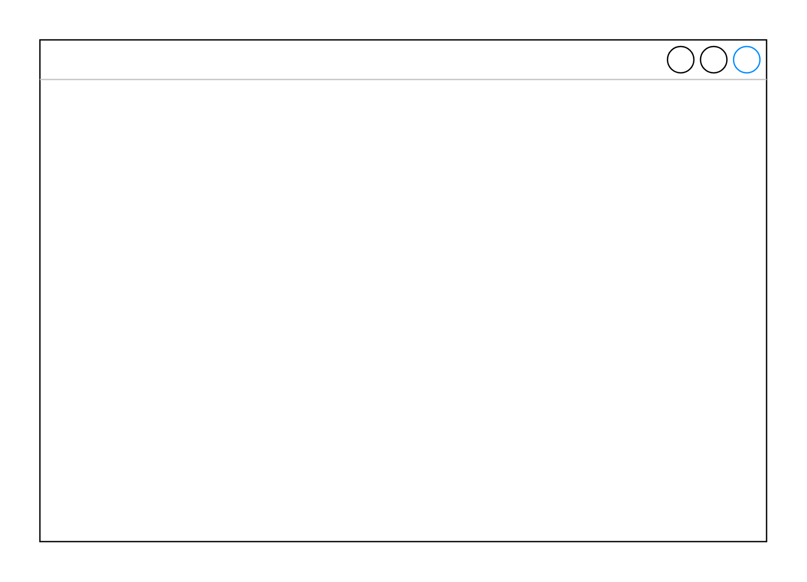

# Mockup Containers Entities

- [Accordion](./accordion.md)  

- [BrowserWindow](./browser-window.md)  

- [DialogBox](./dialog-box.md)  

- [Group](./group.md)  

- [HorizontalTabBar](./horizontal-tab-bar.md)  

- [UserFemale](./user-female.md)  

- [UserMale](./user-male.md)  

- [VerticalTabBar](./vertical-tab-bar.md)  

- [VideoPlayer](./video-player.md)  

- [Window](./window.md)  

