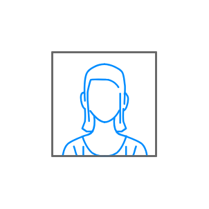

# User, Female

## Definition

```js
{
  _style: {
    entity: 'verticalLabelPosition=bottom;shadow=0;dashed=0;align=center;html=1;verticalAlign=top;strokeWidth=1;shape=mxgraph.mockup.containers.userFemale;strokeColor=#666666;strokeColor2=#008cff;',
  },
  _original_width: 100,
  _original_height: 100,

}
```

## Usage

```js
import { UserFemale } from '@dinghy/standard-components-diagrams/mockupContainers'

<UserFemale/>
```

## Preview


