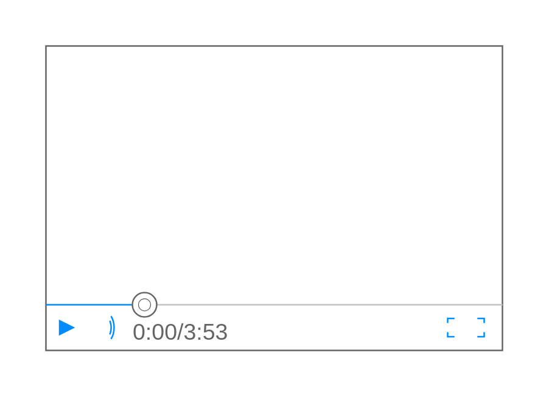

# Video Player

## Definition

```js
{
  _style: {
    entity: 'verticalLabelPosition=bottom;shadow=0;dashed=0;align=center;html=1;verticalAlign=top;strokeWidth=1;shape=mxgraph.mockup.containers.videoPlayer;strokeColor=#666666;strokeColor2=#008cff;strokeColor3=#c4c4c4;textColor=#666666;fillColor2=#008cff;barHeight=30;barPos=20;',
  },
  _width: 300,
  _height: 200,
}
```

## Usage

```js
import { VideoPlayer } from '@dinghy/standard-components-diagrams/mockupContainers'

<VideoPlayer/>
```

## Preview


