# Mockup Forms Entities

- [Calendar](./calendar.md)  
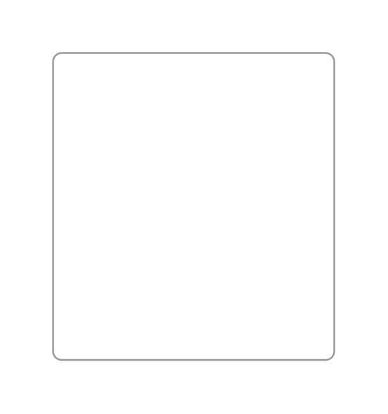

- [Checkbox](./checkbox.md)  
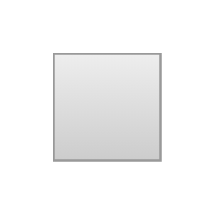

- [Checkboxes](./checkboxes.md)  

- [ColorPicker](./color-picker.md)  
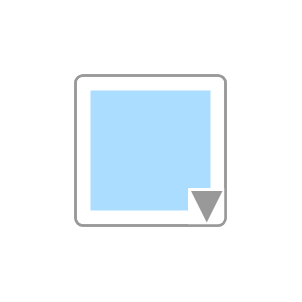

- [ComboBox](./combo-box.md)  
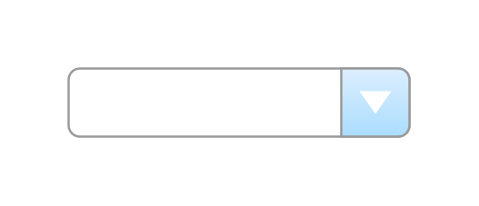

- [Email](./email.md)  

- [Email2](./email-2.md)  

- [Email3](./email-3.md)  
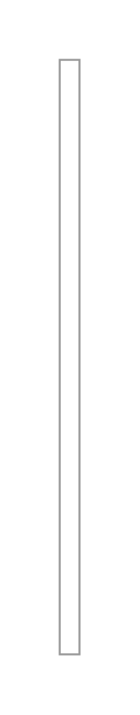

- [FormattingToolbar1](./formatting-toolbar-1.md)  
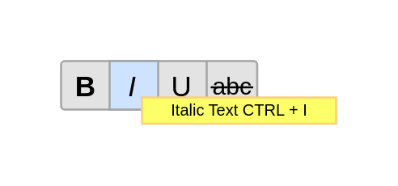

- [FormattingToolbar2](./formatting-toolbar-2.md)  
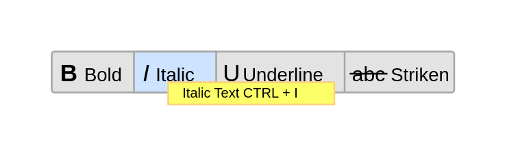

- [FormattingToolbar3](./formatting-toolbar-3.md)  
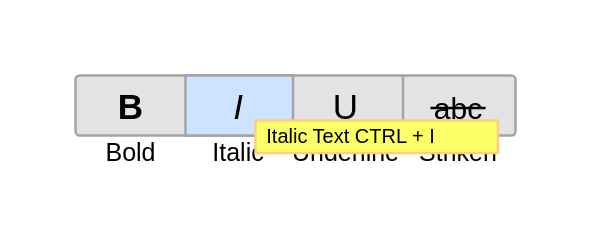

- [HorizontalSlider](./horizontal-slider.md)  
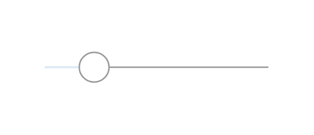

- [HorizontalSplitter](./horizontal-splitter.md)  

- [ListBox](./list-box.md)  

- [MenuBar](./menu-bar.md)  

- [PasswordField](./password-field.md)  
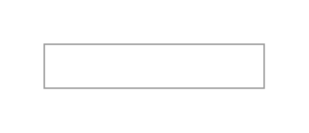

- [Radiobutton](./radiobutton.md)  
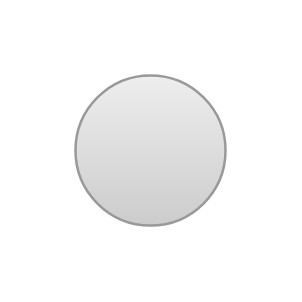

- [SearchBox](./search-box.md)  
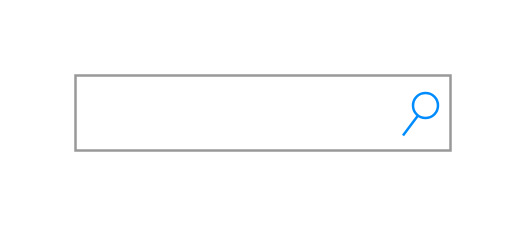

- [SignIn](./sign-in.md)  
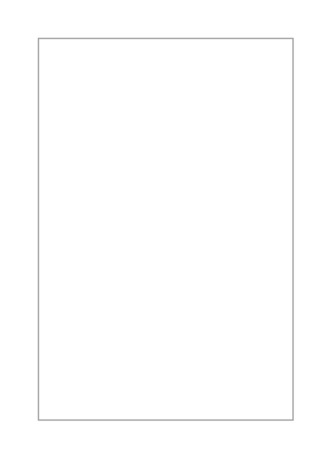

- [Spinner](./spinner.md)  
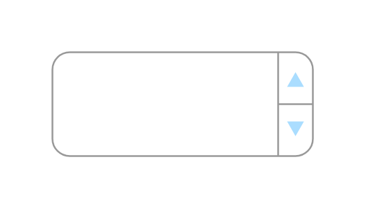

- [VerticalSlider](./vertical-slider.md)  

- [VerticalSplitter](./vertical-splitter.md)  

- [WedgeBar](./wedge-bar.md)  

- [WedgeBar2](./wedge-bar-2.md)  

