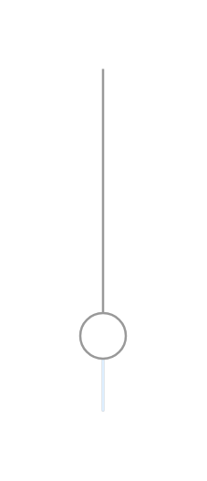

# Vertical Slider

## Definition

```js
{
  _style: {
    entity: 'verticalLabelPosition=bottom;shadow=0;dashed=0;align=center;html=1;verticalAlign=top;strokeWidth=1;shape=mxgraph.mockup.forms.horSlider;strokeColor=#999999;sliderStyle=basic;sliderPos=20;handleStyle=circle;fillColor2=#ddeeff;direction=north;',
  },
  _width: 30,
  _height: 150,
}
```

## Usage

```js
import { VerticalSlider } from '@dinghy/standard-components-diagrams/mockupForms'

<VerticalSlider/>
```

## Preview


