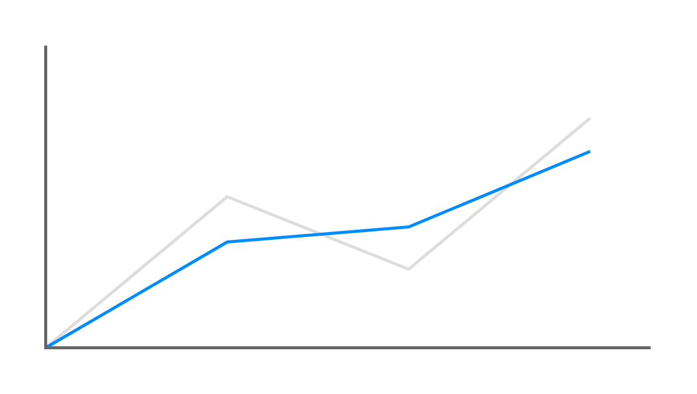

# Line Chart

## Definition

```js
{
  _style: {
    entity: 'verticalLabelPosition=bottom;shadow=0;dashed=0;align=center;html=1;verticalAlign=top;strokeWidth=1;shape=mxgraph.mockup.graphics.lineChart;strokeColor=none;strokeColor2=#666666;strokeColor3=#008cff;strokeColor4=#dddddd;',
  },
  _width: 400,
  _height: 200,
}
```

## Usage

```js
import { LineChart } from '@dinghy/standard-components-diagrams/mockupGraphics'

<LineChart/>
```

## Preview


