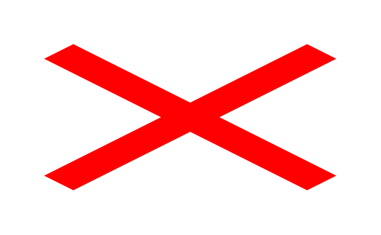
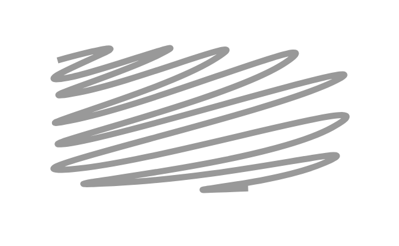

# Mockup Markup Entities

- [HorizontalCurlyBrace](./horizontal-curly-brace.md)  

- [HorizontalLine](./horizontal-line.md)  

- [RedX](./red-x.md)  

- [ScratchOut](./scratch-out.md)  

- [VerticalCurlyBrace](./vertical-curly-brace.md)  

- [VerticalLine](./vertical-line.md)  

