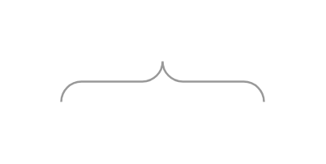

# Horizontal Curly Brace

## Definition

```js
{
  _style: {
    entity: 'verticalLabelPosition=bottom;shadow=0;dashed=0;align=center;html=1;verticalAlign=top;strokeWidth=1;shape=mxgraph.mockup.markup.curlyBrace;whiteSpace=wrap;strokeColor=#999999;',
  },
  _width: 100,
  _height: 20,
}
```

## Usage

```js
import { HorizontalCurlyBrace } from '@dinghy/standard-components-diagrams/mockupMarkup'

<HorizontalCurlyBrace/>
```

## Preview


