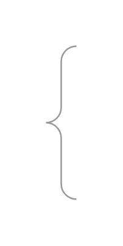

# Vertical Curly Brace

## Definition

```js
{
  _style: {
    entity: 'labelPosition=right;align=left;strokeWidth=1;shape=mxgraph.mockup.markup.curlyBrace;html=1;shadow=0;dashed=0;strokeColor=#999999;direction=north;',
  },
  _width: 20,
  _height: 100,
}
```

## Usage

```js
import { VerticalCurlyBrace } from '@dinghy/standard-components-diagrams/mockupMarkup'

<VerticalCurlyBrace/>
```

## Preview


