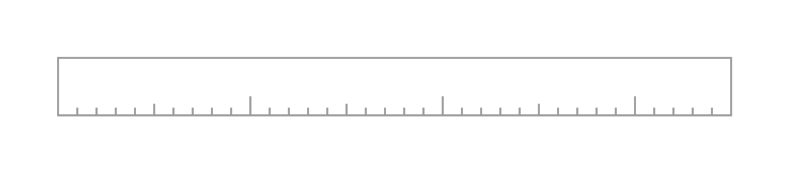
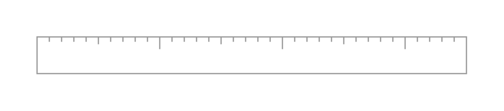
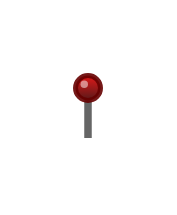
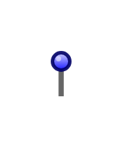
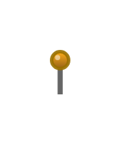
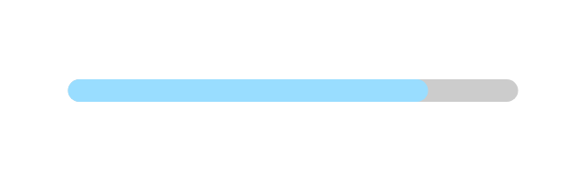
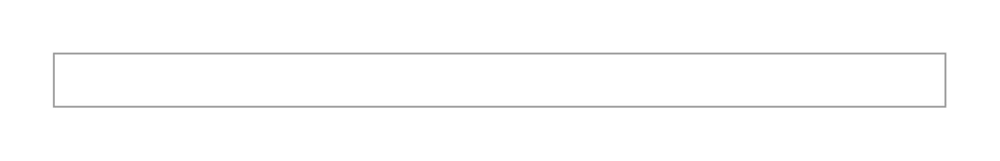
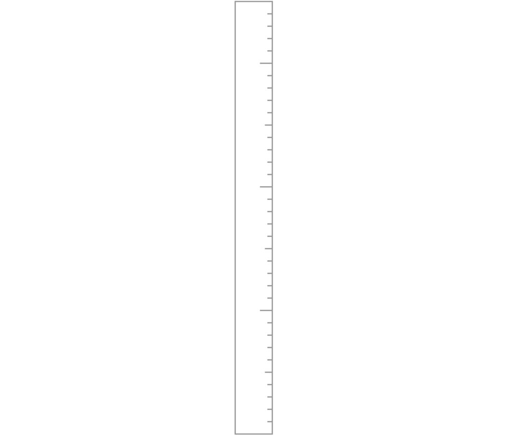
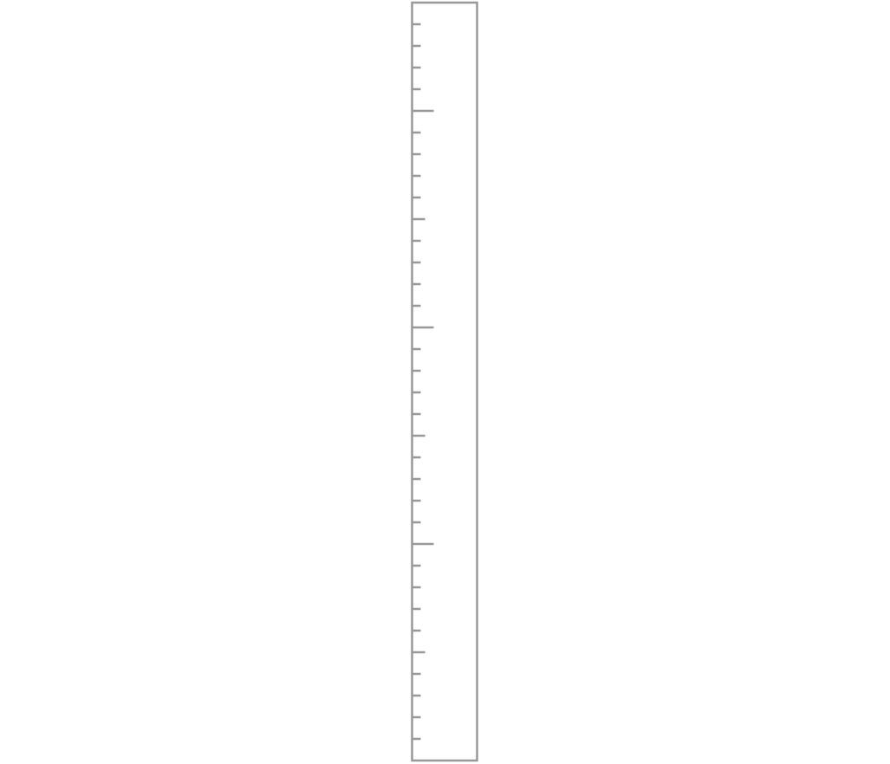
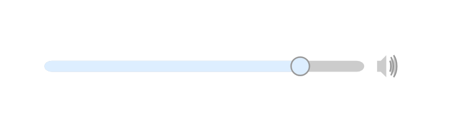

# Mockup Misc Entities

- [Copyright](./copyright.md)  

- [EditIcon](./edit-icon.md)  

- [HelpIcon](./help-icon.md)  

- [HorizontalRuler](./horizontal-ruler.md)  

- [HorizontalRuler2](./horizontal-ruler-2.md)  

- [Mail](./mail.md)  

- [Pin](./pin.md)  

- [Pin2](./pin-2.md)  

- [Pin3](./pin-3.md)  

- [Pin4](./pin-4.md)  

- [Pin5](./pin-5.md)  

- [PlaybackControls](./playback-controls.md)  

- [PrintIcon](./print-icon.md)  

- [ProgressBar](./progress-bar.md)  

- [Rating](./rating.md)  

- [Registered](./registered.md)  

- [RevisionTable](./revision-table.md)  

- [ShareIcon](./share-icon.md)  

- [ShoppingCart](./shopping-cart.md)  

- [StatusBar](./status-bar.md)  

- [TrashcanIcon](./trashcan-icon.md)  

- [VerticalRuler](./vertical-ruler.md)  

- [VerticalRuler2](./vertical-ruler-2.md)  

- [Volume](./volume.md)  

- [VolumeSlider](./volume-slider.md)  

