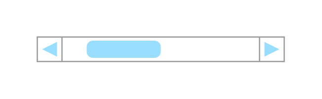
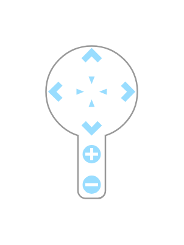
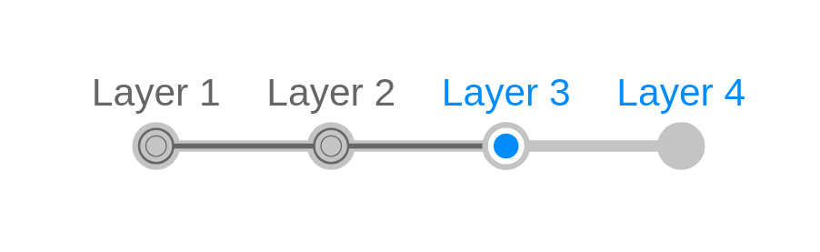
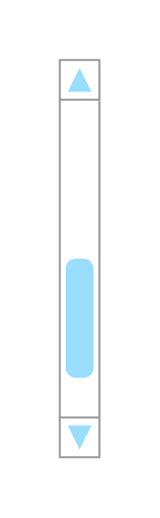

# Mockup Navigation Entities

- [Breadcrumb](./breadcrumb.md)  

- [Breadcrumb2](./breadcrumb-2.md)  

- [Breadcrumb3](./breadcrumb-3.md)  

- [CoverFlow](./cover-flow.md)  

- [HorizontalScrollBar](./horizontal-scroll-bar.md)  

- [MapNavigator](./map-navigator.md)  

- [PageControl](./page-control.md)  

- [Pagination](./pagination.md)  

- [StepBar](./step-bar.md)  

- [StepBar2](./step-bar-2.md)  

- [VerticalScrollBar](./vertical-scroll-bar.md)  

- [WheelThrobber1](./wheel-throbber-1.md)  

- [WheelThrobber2](./wheel-throbber-2.md)  

