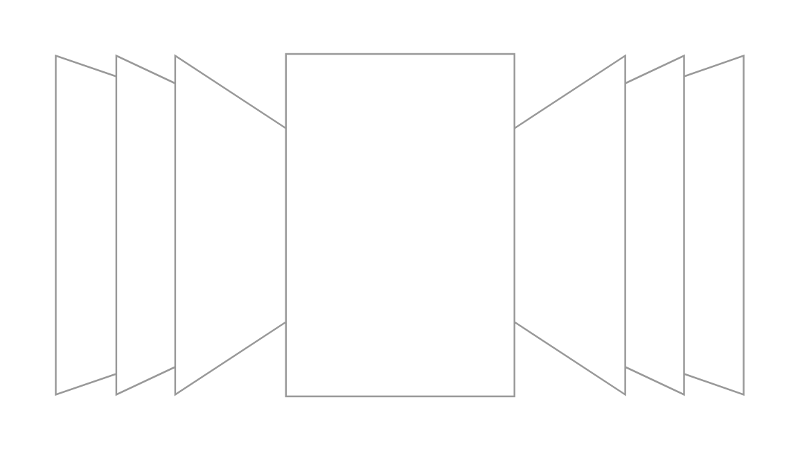

# Cover Flow

## Definition

```js
{
  _style: {
    entity: 'verticalLabelPosition=bottom;shadow=0;dashed=0;align=center;html=1;verticalAlign=top;strokeWidth=1;shape=mxgraph.mockup.navigation.coverFlow;strokeColor=#999999;',
  },
  _width: 400,
  _height: 200,
}
```

## Usage

```js
import { CoverFlow } from '@dinghy/standard-components-diagrams/mockupNavigation'

<CoverFlow/>
```

## Preview


