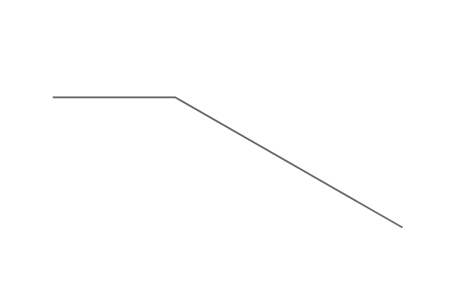
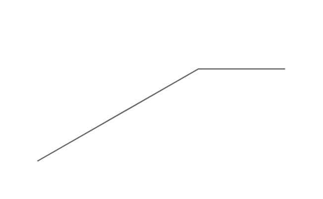
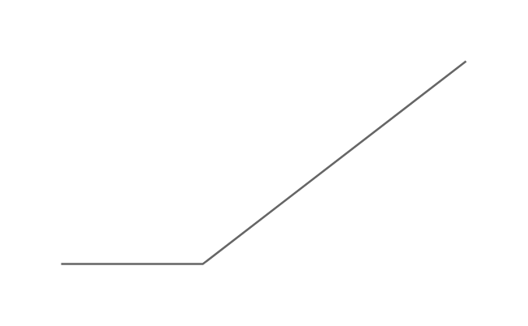
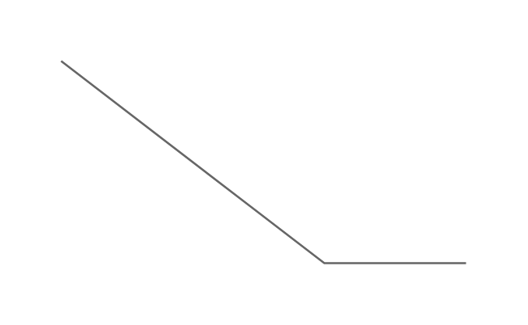
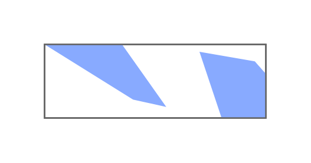

# Mockup Text Entities

- [Alphanumeric](./alphanumeric.md)  

- [BulletedList](./bulleted-list.md)  

- [Callout](./callout.md)  

- [Callout2](./callout-2.md)  

- [Callout3](./callout-3.md)  

- [Callout4](./callout-4.md)  

- [Captcha](./captcha.md)  

- [HorizontalButtonBar](./horizontal-button-bar.md)  

- [Link](./link.md)  

- [ParagraphOfText](./paragraph-of-text.md)  

- [StickyNote](./sticky-note.md)  

- [TextBox](./text-box.md)  

