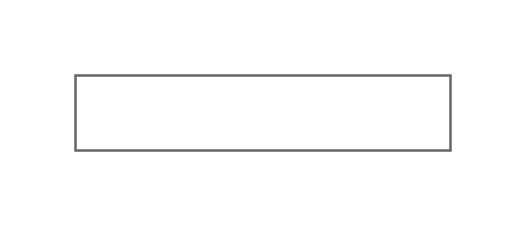

# Text Box

## Definition

```js
{
  _style: {
    entity: 'strokeWidth=1;shadow=0;dashed=0;align=center;html=1;shape=mxgraph.mockup.text.textBox;fontColor=#666666;align=left;fontSize=17;spacingLeft=4;spacingTop=-3;whiteSpace=wrap;strokeColor=#666666;mainText=',
  },
  _width: 150,
  _height: 30,
}
```

## Usage

```js
import { TextBox } from '@dinghy/standard-components-diagrams/mockupText'

<TextBox/>
```

## Preview


