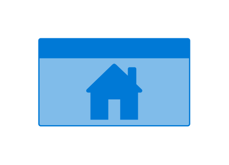

# Home

## Definition

```js
{
  _style: {
    entity: 'html=1;whiteSpace=wrap;strokeColor=none;fillColor=#0079D6;labelPosition=center;verticalLabelPosition=middle;verticalAlign=top;align=center;fontSize=12;outlineConnect=0;spacingTop=-6;fontColor=#FFFFFF;sketch=0;shape=mxgraph.sitemap.home;',
  },
  _width: 120,
  _height: 70,
}
```

## Usage

```js
import { Home } from '@dinghy/standard-components-diagrams/sitemap'

<Home/>
```

## Preview


