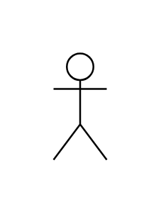
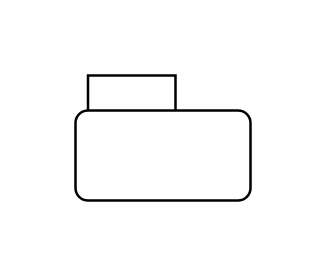

# Uml UML Entities

- [Activity](./activity.md)  

- [Actor](./actor.md)  

- [Block](./block.md)  

- [BoundaryObject](./boundary-object.md)  

- [Callback](./callback.md)  

- [Callback2](./callback-2.md)  

- [Class](./class.md)  

- [Class2](./class-2.md)  

- [Component](./component.md)  

- [ComponentWithAttributes](./component-with-attributes.md)  

- [CompositeState](./composite-state.md)  

- [Condition](./condition.md)  

- [Condition2](./condition-2.md)  

- [Condition3](./condition-3.md)  

- [ControlObject](./control-object.md)  

- [Destruction](./destruction.md)  

- [Divider](./divider.md)  

- [End](./end.md)  

- [EntityObject](./entity-object.md)  

- [ForkJoin](./fork-join.md)  

- [FoundMessage](./found-message.md)  

- [FoundMessage3](./found-message-3.md)  

- [Frame](./frame.md)  

- [Item1](./item-1.md)  

- [Item2](./item-2.md)  

- [LollipopNotation](./lollipop-notation.md)  

- [LollipopNotation2](./lollipop-notation-2.md)  

- [Module](./module.md)  

- [Object](./object.md)  

- [Object2](./object-2.md)  

- [Package](./package.md)  

- [ProvidedRequiredInterface](./provided-required-interface.md)  

- [RequiredInterface](./required-interface.md)  

- [RequiredInterface2](./required-interface-2.md)  

- [RequiredInterface3](./required-interface-3.md)  

- [SelfCall](./self-call.md)  

- [Spacer](./spacer.md)  

- [Start](./start.md)  

- [Start2](./start-2.md)  

- [SynchronousInvocation](./synchronous-invocation.md)  

- [SynchronousInvocation2](./synchronous-invocation-2.md)  

- [Title](./title.md)  

- [UseCase](./use-case.md)  

