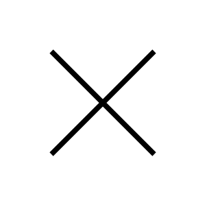

# Destruction

## Definition

```js
{
  _style: {
    entity: 'shape=umlDestroy;whiteSpace=wrap;html=1;strokeWidth=3;targetShapes=umlLifeline;',
  },
  _original_width: 30,
  _original_height: 30,

}
```

## Usage

```js
import { Destruction } from '@dinghy/standard-components-diagrams/uml'

<Destruction/>
```

## Preview


