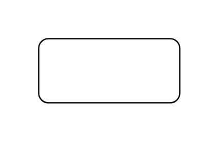

# Object

## Definition

```js
{
  _style: {
    entity: 'html=1;whiteSpace=wrap;',
  },
  _width: 110,
  _height: 50,
}
```

## Usage

```js
import { Object } from '@dinghy/standard-components-diagrams/uml'

<Object/>
```

## Preview


