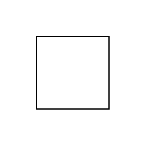

# Required Interface 2

## Definition

```js
{
  _style: {
    entity: 'rounded=0;orthogonalLoop=1;jettySize=auto;html=1;endArrow=halfCircle;endFill=0;endSize=6;strokeWidth=1;sketch=0;fontSize=12;curved=1;',
  },
  _original_width: 20,
  _original_height: 20,

}
```

## Usage

```js
import { RequiredInterface2 } from '@dinghy/standard-components-diagrams/uml'

<RequiredInterface2/>
```

## Preview


