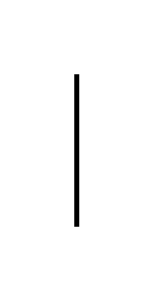

# Self Call

## Definition

```js
{
  _style: {
    entity: 'html=1;align=left;spacingLeft=2;endArrow=block;rounded=0;edgeStyle=orthogonalEdgeStyle;curved=0;rounded=0;',
  },
  _width: 1,
  _height: 60,
}
```

## Usage

```js
import { SelfCall } from '@dinghy/standard-components-diagrams/uml'

<SelfCall/>
```

## Preview


