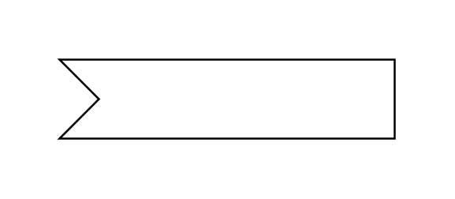

# Accept Event Action

## Definition

```js
{
  _style: {
    entity: 'html=1;shape=mxgraph.infographic.ribbonSimple;notch1=20;notch2=0;align=center;verticalAlign=middle;fontSize=14;fontStyle=0;fillColor=#FFFFFF;flipH=0;spacingRight=0;spacingLeft=14;whiteSpace=wrap;',
  },
  _width: 170,
  _height: 40,
}
```

## Usage

```js
import { AcceptEventAction } from '@dinghy/standard-components-diagrams/uml25'

<AcceptEventAction/>
```

## Preview


