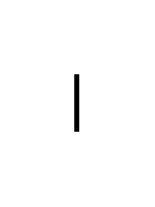

# Association / Instance Secification 2

## Definition

```js
{
  _style: {
    entity: 'endArrow=none;html=1;rounded=0;align=center;verticalAlign=bottom;labelBackgroundColor=none;',
  },
  _width: 1,
  _height: 22,
}
```

## Usage

```js
import { AssociationInstanceSecification2 } from '@dinghy/standard-components-diagrams/uml25'

<AssociationInstanceSecification2/>
```

## Preview


