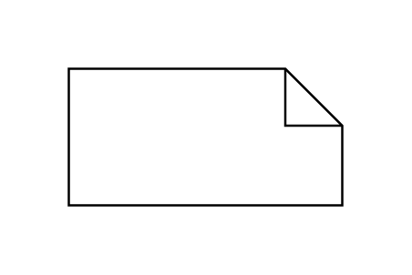

# Comment

## Definition

```js
{
  _style: {
    entity: 'shape=note2;boundedLbl=1;whiteSpace=wrap;html=1;size=25;verticalAlign=top;align=center;',
  },
  _width: 120,
  _height: 60,
}
```

## Usage

```js
import { Comment } from '@dinghy/standard-components-diagrams/uml25'

<Comment/>
```

## Preview


