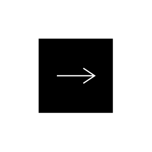

# Output Pin 2

## Definition

```js
{
  _style: {
    entity: 'shape=mxgraph.uml25.inputPin;html=1;points=[[0,0.5],[1,0.5]];strokeColor=#ffffff;fillColor=#000000;flipH=1;',
  },
  _original_width: 30,
  _original_height: 30,

}
```

## Usage

```js
import { OutputPin2 } from '@dinghy/standard-components-diagrams/uml25'

<OutputPin2/>
```

## Preview


