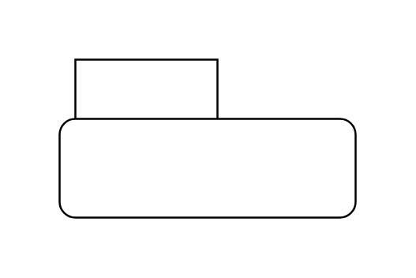

# Package

## Definition

```js
{
  _style: {
    entity: 'shape=folder;fontStyle=1;tabWidth=80;tabHeight=30;tabPosition=left;html=1;boundedLbl=1;whiteSpace=wrap;',
  },
  _width: 150,
  _height: 80,
}
```

## Usage

```js
import { Package } from '@dinghy/standard-components-diagrams/uml25'

<Package/>
```

## Preview


