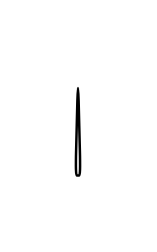

# Parameter 3

## Definition

```js
{
  _style: {
    entity: 'triangle;html=1;direction=north;',
  },
  _width: 2,
  _height: 40,
}
```

## Usage

```js
import { Parameter3 } from '@dinghy/standard-components-diagrams/uml25'

<Parameter3/>
```

## Preview


